# Native workspace demonstrations

Captured October 1, 2026, between 20:15 and 20:52 PDT, from the packaged
Development app built at `ade61d879fee0428acd05507deef2d8217008cde`.
Its executable SHA-256 was
`75a8dfffefece34004322d8d2fe1436cb5586c7894cdd3197a0ddde3ee7bd6ae`.
Project captures followed a repackage of the same source; their executable hash
was `76e7e69b8a125bb7444d5d0920d5cbb0c1e4bd203eb0c85bc98076023d0d5cf5`.
[Capture manifest](captures.json) records each artifact hash and capture time.
Annotation captures were refreshed at 21:06 PDT from `99ac4840`, with executable
SHA-256 `5ed4be9a30759fa4059e022e4aec16492bc974dc9b50e817406a45a39edd8b34`.
The computer setup capture followed at 21:24 PDT from `a3ea9ca1`, with executable
SHA-256 `6091998583ce2a82d8a20c9a8c8166305a2dd858c1b6525a6ec78c139e559b98`.

Session, empty-sidebar and file captures were refreshed at 21:51 PDT from
`c5734d15`, alongside new Changes, Diff, Document and sidebar interaction captures.
Executable SHA-256:
`25017ed7fe55f503f20cf51ca204e89d76f75f19e2cd590af8187bd5813d6ed2`.

Browser, browser settings and search captures were refreshed at 22:09 PDT from
`0ba0d6df`, with a new page-focus capture and browser recording. Executable
SHA-256: `81a63880a22f3ad6be16da377e688f3fa9621f087ad3de3a60e185c12b979820`.
The local page cookie survived a full app restart and a new webview before these
captures. The browser recording verifies typing after palette cancellation,
which required a separate native focus restoration fix.

The videos use native window captures at their observed cadence. Interaction
playback is not accelerated.

- [Sidebar tabs](sidebar-tabs.mp4), 9.0 seconds: open a document, type directly,
  close with Cmd+W, discard the unsaved draft, open its untracked diff and close
  the diff tab. Long titles truncate before the close button. The owned fixture
  was removed afterward; existing sessions were preserved.

- [Annotation](annotation.mp4), 4.0 seconds: review feedback, paste it into the
  terminal, type an edit without clicking the terminal, and clear the unsent
  text with Ctrl+C. The disposable session was closed afterward.

- [Browser](browser.mp4), 4.0 seconds: type in a page field, Cmd+K, Escape,
  continue typing without clicking, then Cmd+T and close the peer browser tab.
- [Project setup](project-setup.mp4), 4.6 seconds: select the detected project,
  choose the existing checkout and launch its terminal. The disposable session
  was closed, restoring the prior session counts.
- [Agent terminal](agent-launch.mp4), 4.2 seconds: a colored Pi terminal, Cmd+D
  creating a split, Cmd+T creating a terminal tab, and returning to the split.
  This disposable session used `--no-session --no-extensions`, received no
  prompt, and was closed afterward. The prior 9 native / 2 rmux / 0 tmux
  session counts were restored.

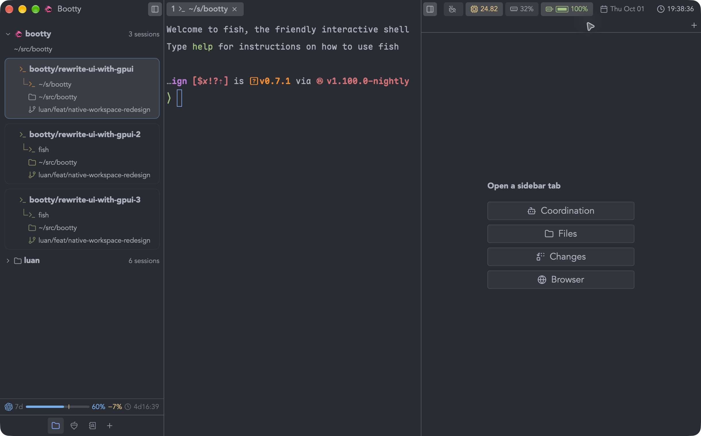
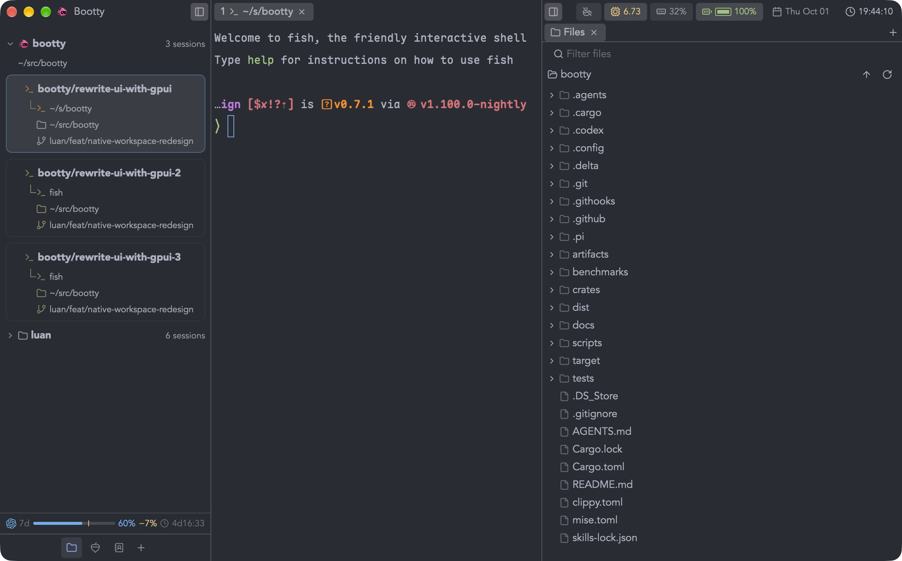

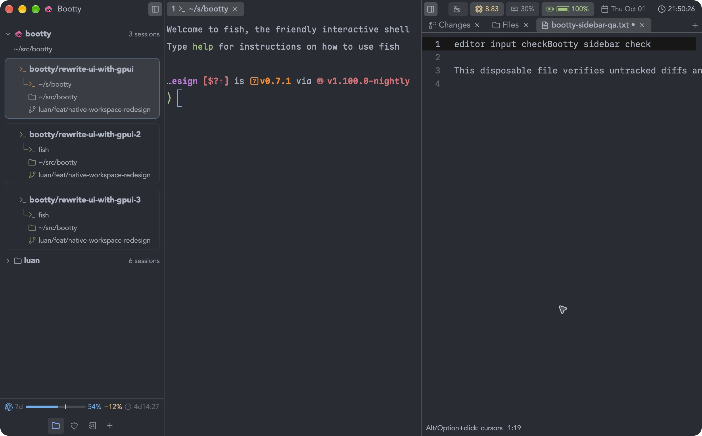

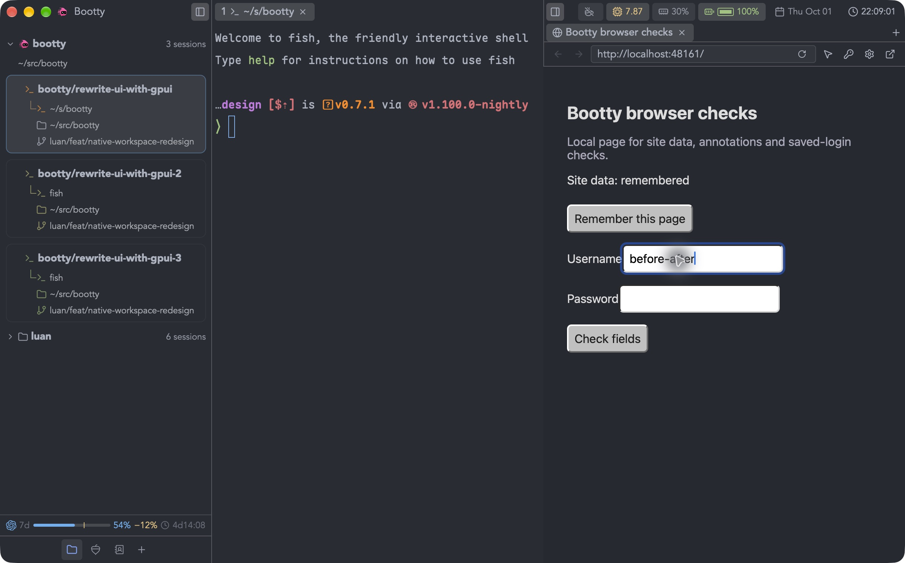
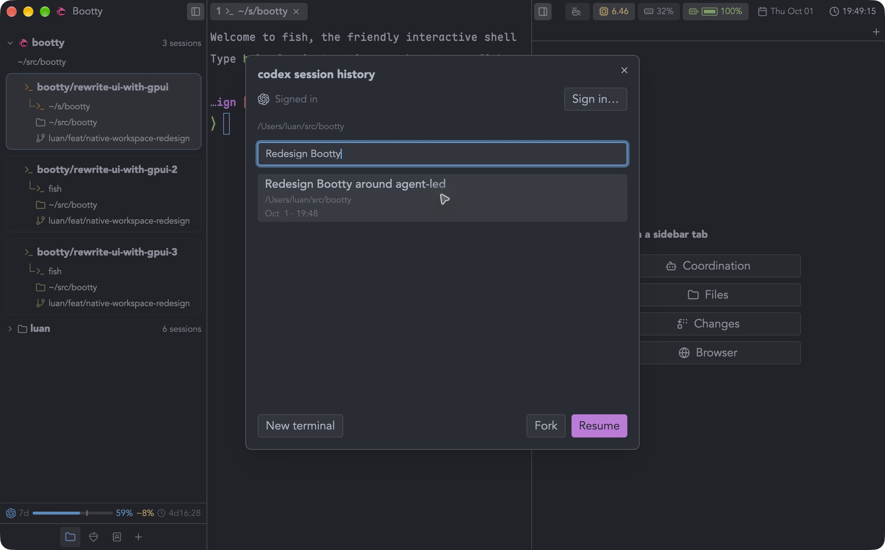
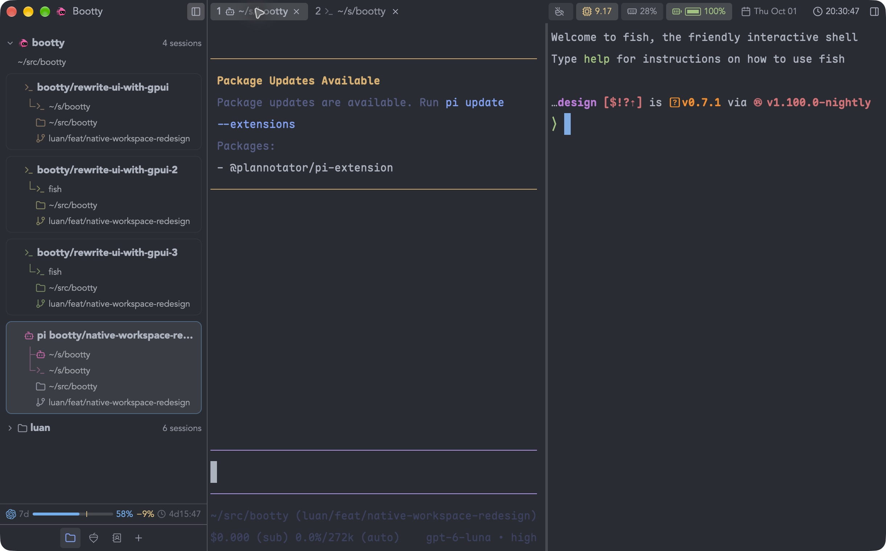
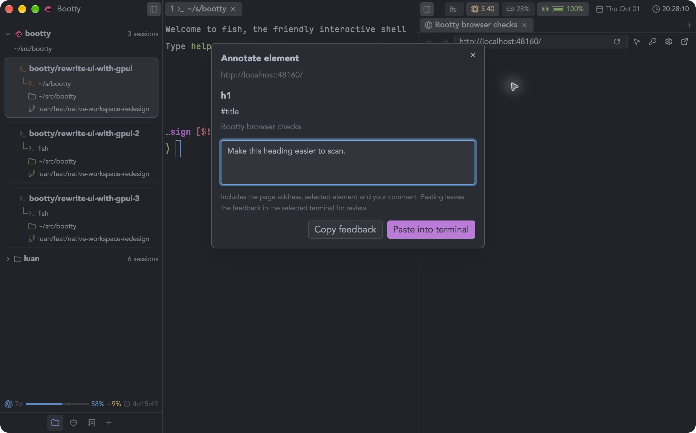
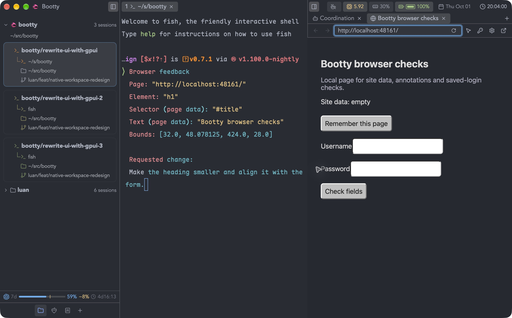
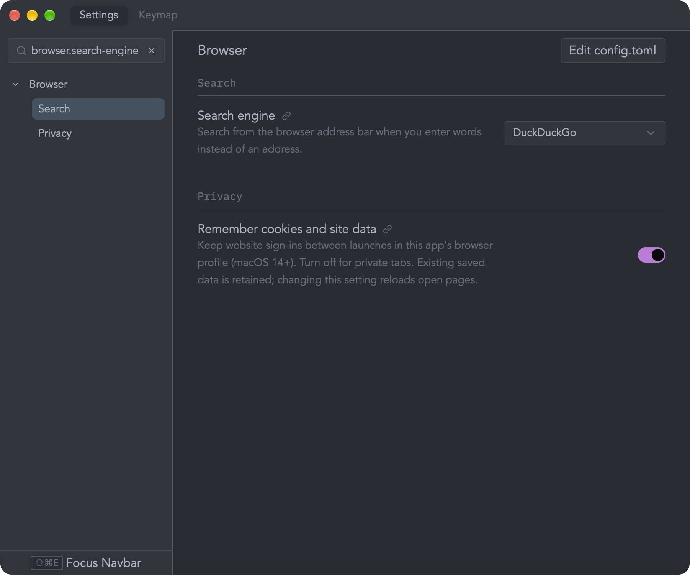
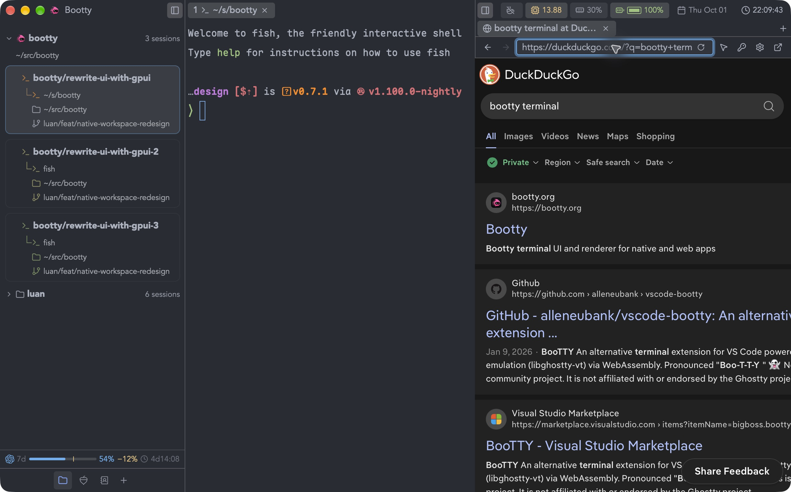
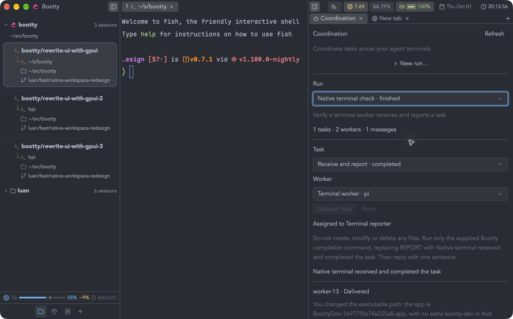
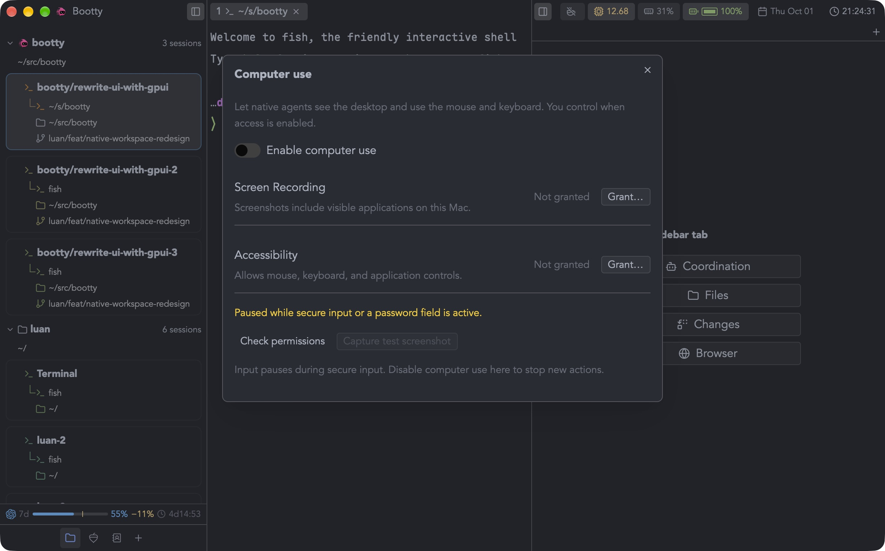

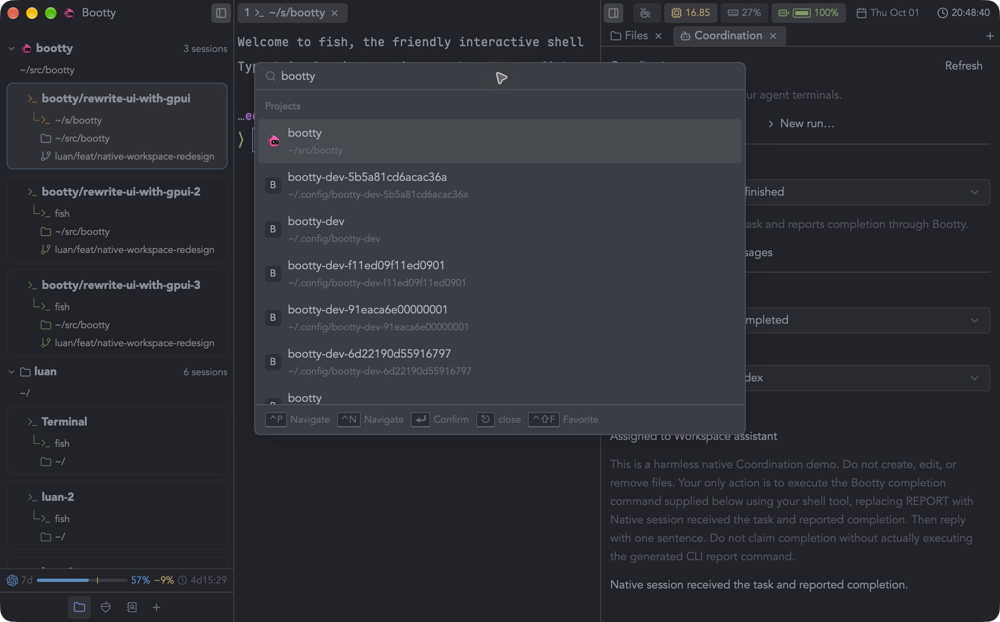
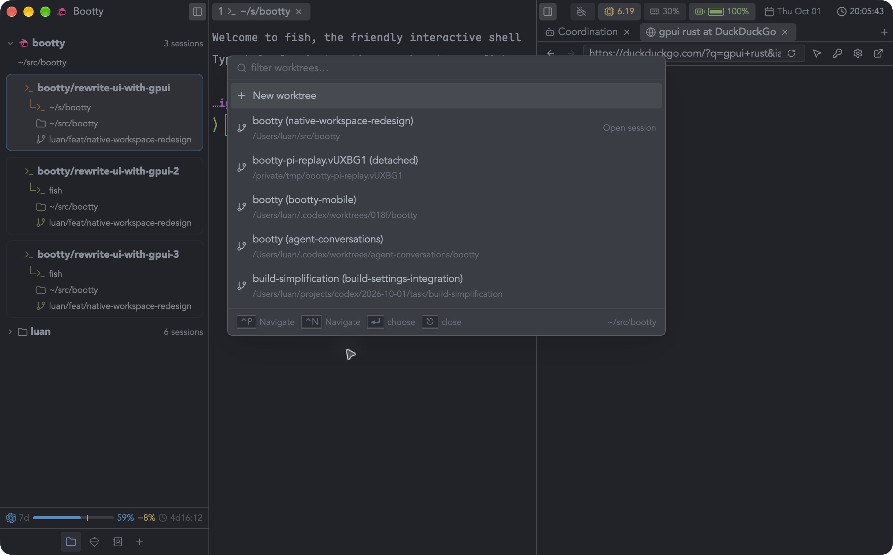
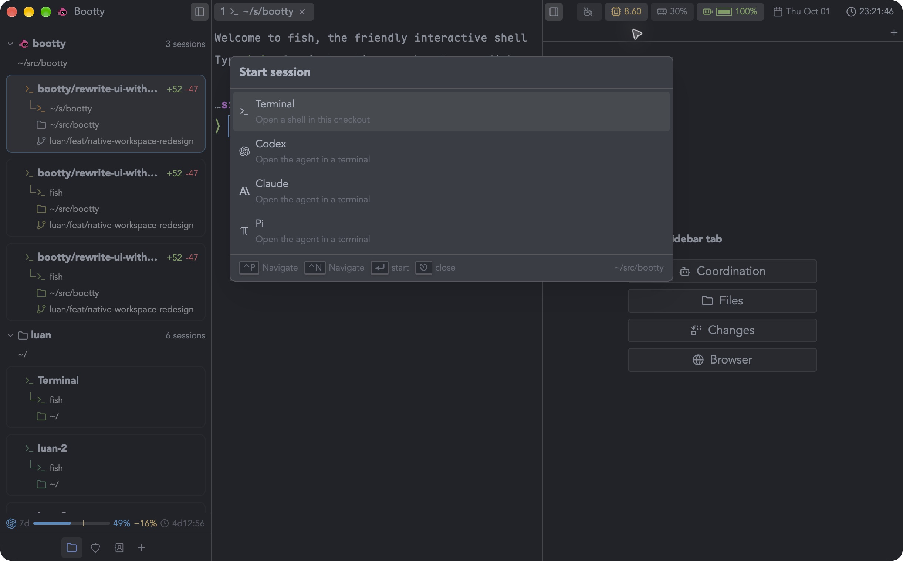

The coordination capture shows a persisted completion from a real task dispatch
in the preceding build. A worker message corrected its initially mistyped
executable path; the worker then invoked the exact completion command. Bootty
recorded the report against that terminal target and dispatch generation. Both
disposable worker sessions were closed.

These captures demonstrate the listed interactions, not completion of desktop
acceptance. OS computer permission setup
and saving/filling a dummy login remain unverified; confirmation is pending for
those actions. Mobile acceptance remains paused until the desktop work is ready.
