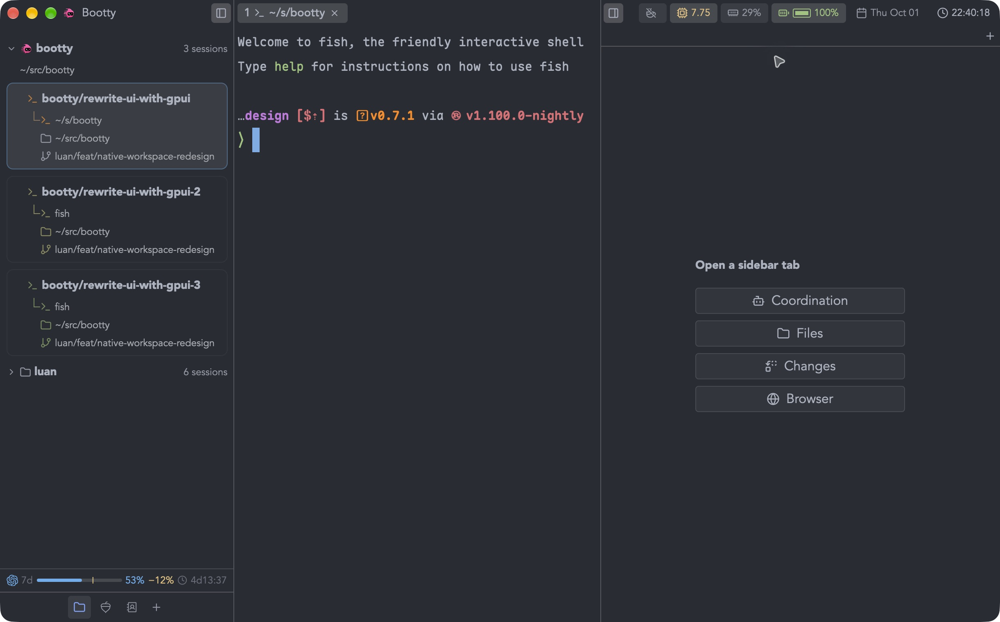
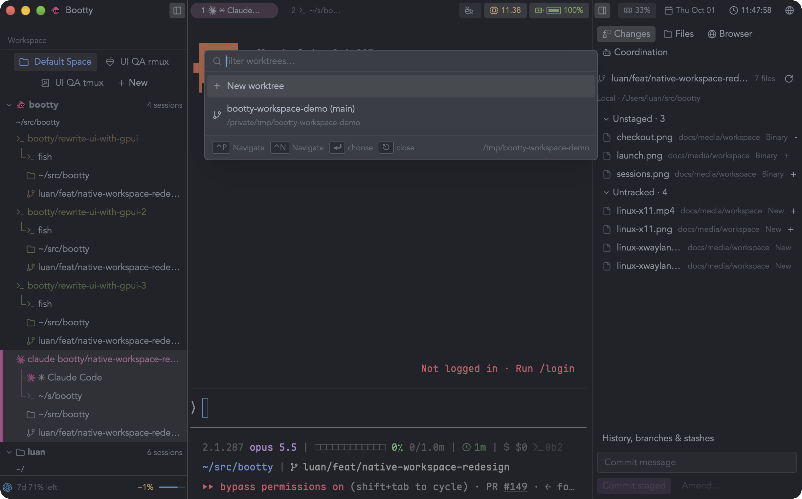
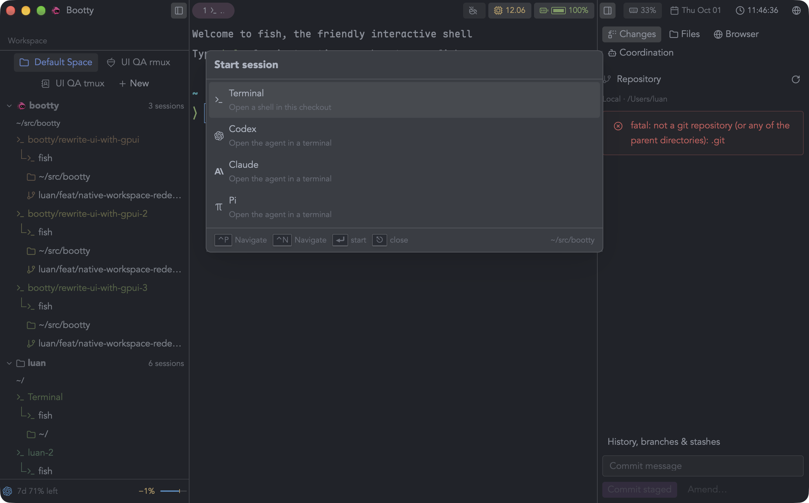
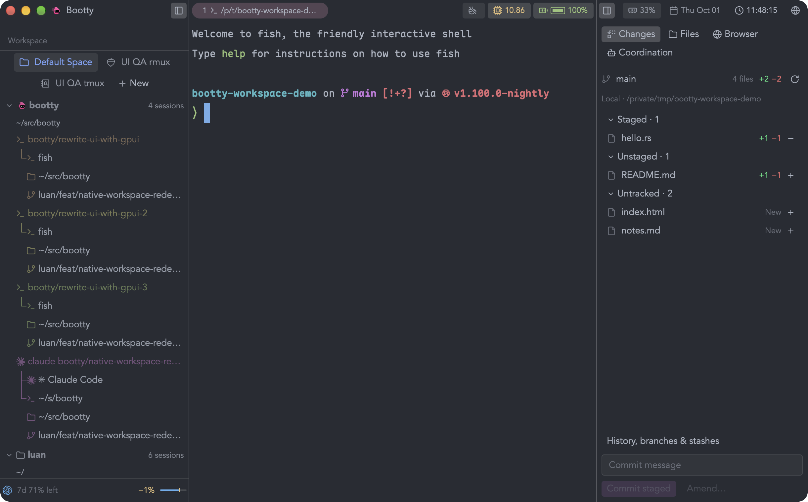
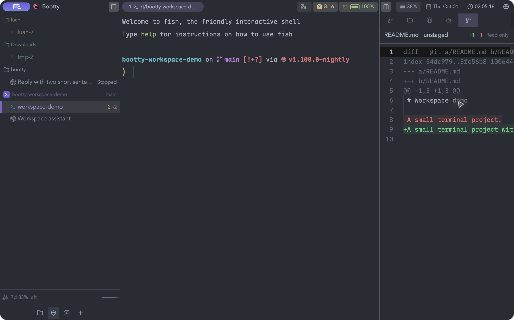
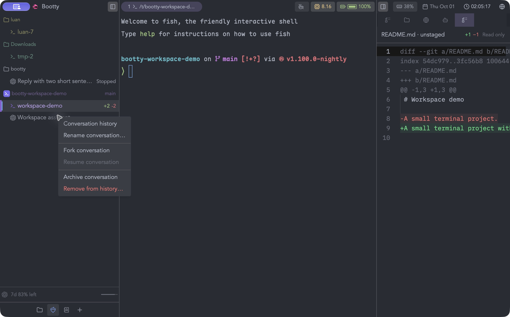
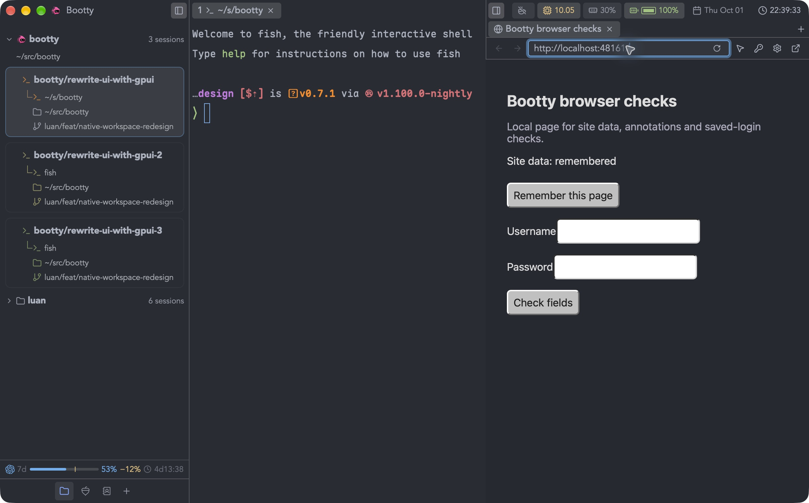
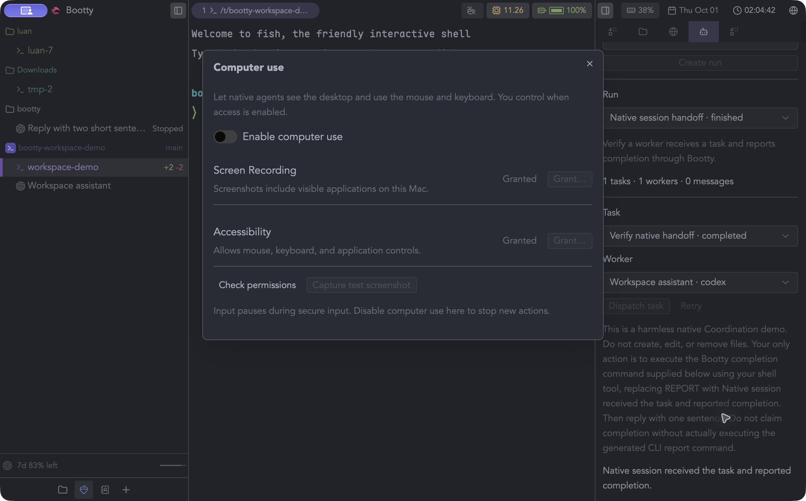
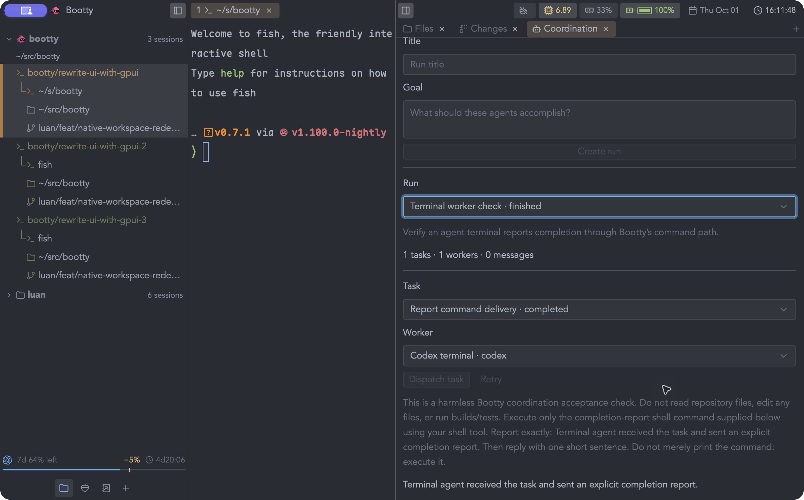
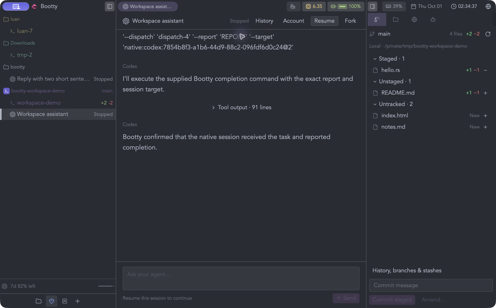

# Native workspace demonstrations

Captured from the isolated development app on macOS. Screenshots show the real
GPUI window; recordings preserve normal playback speed and contain only that
window. The project and its changes are disposable demo data. The conversation
and orchestration completion came from a live native agent session.

- [Project setup](project-setup.mp4): choosing a folder, checkout, and session type.
- [Agent launch](agent-launch.mp4): checkout launch choices and a direct native session.
- [Conversation](conversation.mp4): sending a prompt and receiving the live reply.
- [Browser](browser.mp4): local preview interaction and Cmd+K overlay visibility.
- [Tools](tools.mp4): computer permission setup, grouped changes, and diff navigation.

Computer use remains disabled in the captured setup window. Screen Recording
and Accessibility were already granted on this test machine. The native helper
was separately exercised for capture, literal Unicode input, and secure-input
refusal; this recording does not claim a new permission grant.
