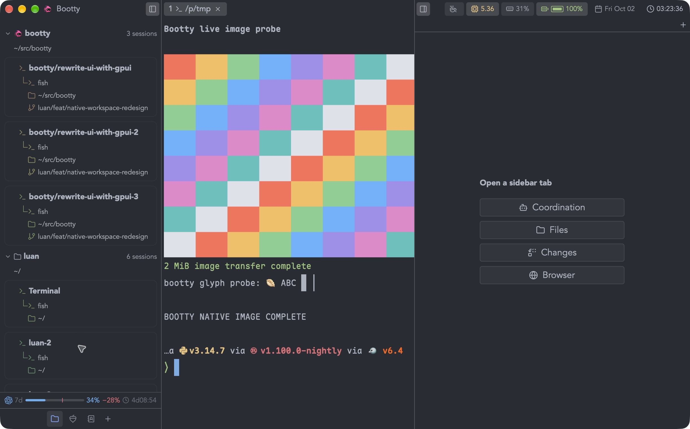
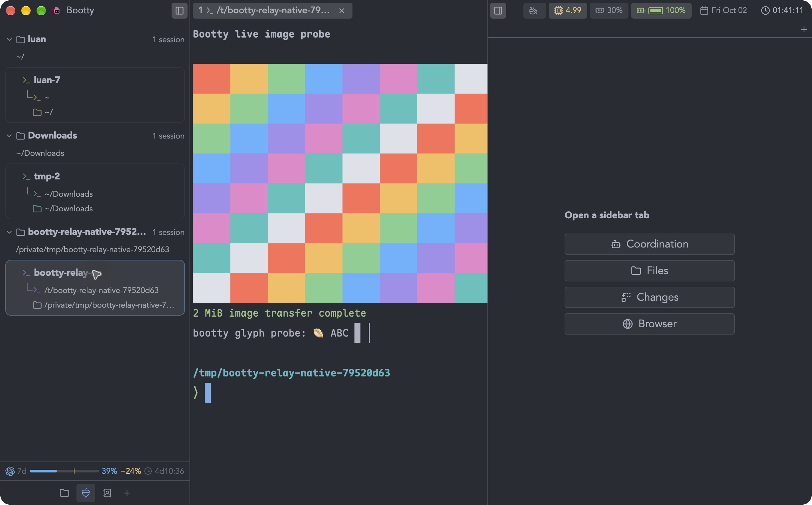
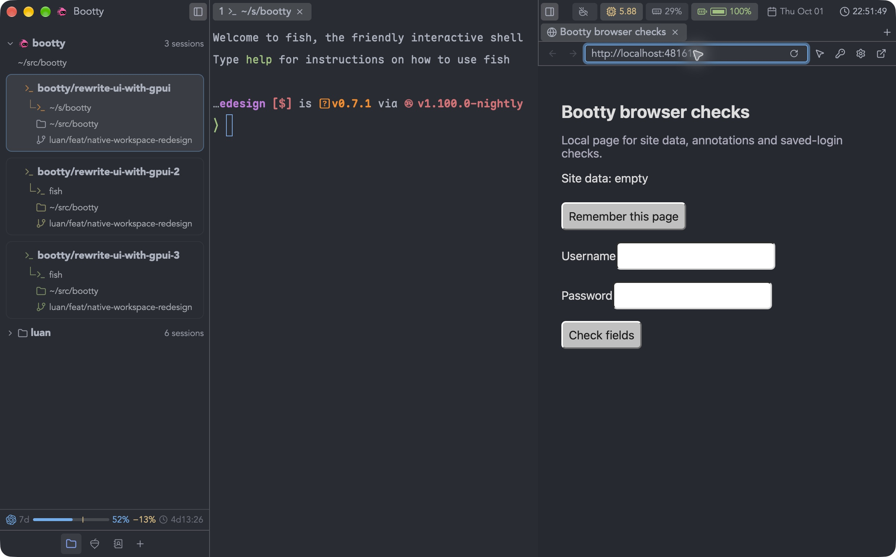
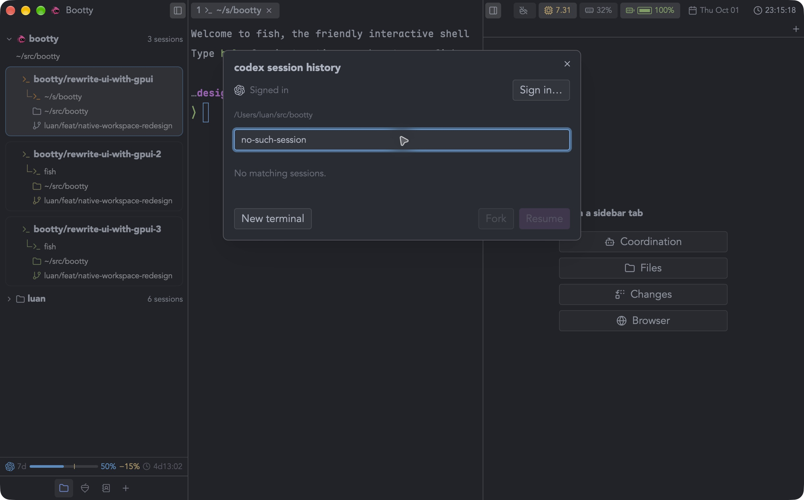
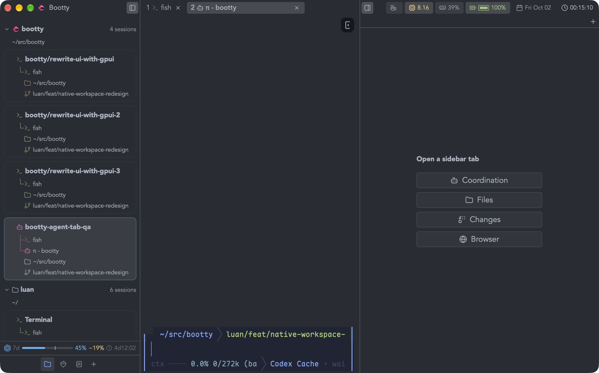

# Native workspace demonstrations

Captured from packaged Development builds on October 1–2, 2026. The
[capture manifest](captures.json) records each artifact's source revision,
executable hash, capture time and SHA-256. History, agent-terminal, session,
empty-sidebar and coordination captures were refreshed from `064cef1d` at
23:12–23:16 PDT. Project setup and tool-close recordings were refreshed from
`7ed43235` at 23:21–23:23 PDT. Browser keyboard and private-cookie lifecycle captures use
`b80cea92`; the manifest identifies the revisions for the remaining interactions.

The direct agent-tab capture uses `892f6f65` at 00:15 PDT on October 2.
The relay-image capture uses `79520d63` at 01:41 PDT on October 2. It predates the recovery change and is diagnostic history.
The native-live-image capture uses `35795b86` at 03:23 PDT on October 2.

The videos use native window captures at their observed cadence. Interaction
playback is not accelerated.

- [Native live image](native-live-image.mp4), 2.4 seconds: the current native PTY
  displays the full 2 MiB image and accepts colored input afterward. The owned
  disposable session was closed and previous selection restored. The companion
  GPUI acceptance checks the complete decoded pixels, image primitives and input.
  This is native evidence, not acceptance of the unresolved rmux graphics limit.
- [Relay image](relay-image.mp4), 3.0 seconds: display a 2 MiB RGBA image
  through the rmux terminal relay, then render the glyph probe. The owned
  disposable session was closed and the original 9 native / 2 rmux / 0 tmux
  session counts and selection restored. This earlier native check passed. The actual PR base fails the unchanged
  rmux image test in 2/10 runs; the recovery stream fails in 10/10. The live
  graphics bug is pre-existing but the measured result is worse, not fixed.
- [Direct agent tab](agent-tab.mp4), 2.4 seconds: choose Open Pi tab from
  Cmd+K and launch the colored provider TUI beside the existing shell in the same
  session. No prompt was sent. The disposable session was closed afterward,
  restoring 9 native / 2 rmux / 0 tmux sessions.
- [Tool close](tool-close.mp4), 2.8 seconds: close a focused Coordination tab,
  open Cmd+K and type immediately without clicking another input.
- [Sidebar tabs](sidebar-tabs.mp4), 9.0 seconds: open a document, type directly,
  close with Cmd+W, discard the unsaved draft, open its untracked diff and close
  the diff tab. Long titles truncate before the close button. The owned fixture
  was removed afterward; existing sessions were preserved.

- [Annotation](annotation.mp4), 4.0 seconds: review feedback, paste it into the
  terminal, type an edit without clicking the terminal, and clear the unsent
  text with Ctrl+C. The disposable session was closed afterward.

- [Browser](browser.mp4), 3.0 seconds: type in a page field, Cmd+K, Escape,
  continue typing without clicking, then Cmd+T and close the peer browser tab.
- [Browser shortcuts](browser-shortcuts.mp4), 2.5 seconds: Cmd+T from the
  address field, type an unsent draft, then Cmd+W to close the peer browser tab.
  The original terminal tab and pane remain present.
- [Project setup](project-setup.mp4), 3.0 seconds: select the detected project,
  choose the existing checkout and launch its terminal. The disposable session
  was closed, restoring the prior session counts.
- [History filtering](history-filter.mp4), 3.2 seconds: select a visible session,
  filter it out, clear the filter and select it again. Resume and Fork stay
  disabled until a visible row is selected. No conversation was resumed.
- [Agent terminal](agent-launch.mp4), 2.4 seconds: a colored Pi terminal, Cmd+D
  creating a split and Cmd+T creating an independent terminal tab.
  This disposable session used `--no-session --no-extensions`, received no
  prompt, and was closed afterward. The prior 9 native / 2 rmux / 0 tmux
  session counts were restored.

The coordination capture shows a persisted completion from a real task dispatch
in the preceding build. A worker message corrected its initially mistyped
executable path; the worker then invoked the exact completion command. Bootty
recorded the report against that terminal target and dispatch generation. Both
disposable worker sessions were closed.

These captures demonstrate the listed interactions, not completion of desktop
acceptance. OS computer permission setup
and saving/filling a dummy login remain unverified; confirmation is pending for
those actions. Mobile acceptance remains paused until the desktop work is ready.
