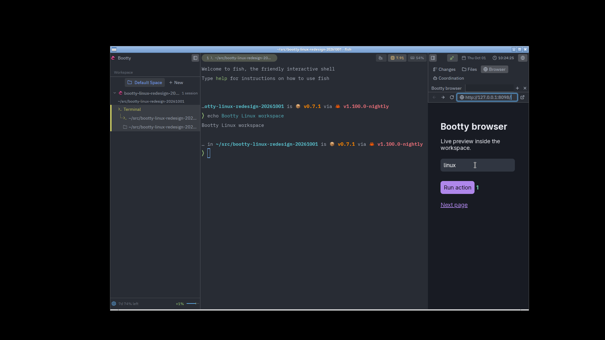
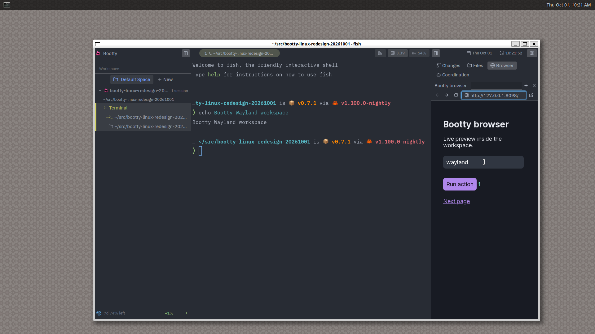

# Native workspace demonstrations

Captured from isolated development apps. Screenshots show real GPUI windows;
recordings preserve normal playback speed, with idle spans trimmed. The project
and its changes are disposable demo data. Agent launches use ordinary backend
terminals, including their normal tabs and splits.

- [Project setup](project-setup.mp4), 17 seconds: project artwork, checkout, and session choices.
- [Agent terminals](agent-launch.mp4), 16 seconds: colored provider TUI, a new terminal tab, and splits.
- [Browser](browser.mp4): top-level, closable page tabs, compact navigation, native input and Cmd+K overlay visibility.
- [Tools](tools.mp4), 14 seconds: grouped changes, tracked diff, and Files navigation.
- [Linux X11](linux-x11.mp4), 12 seconds, and [XWayland](linux-xwayland.mp4),
  12 seconds: native browser input, navigation, resize, and palette restoration.

Computer use is disabled and the current development identity reports Screen
Recording and Accessibility as not granted. The native helper was separately
exercised for capture, literal Unicode input, and secure-input refusal; these
screenshots do not claim a new permission grant. The completed coordination run
came from a real Codex terminal executing the supplied completion command.

Linux browser embedding uses an X11 display, including XWayland. Pure Wayland
without XWayland is unsupported. Optional agent conversations have separate
demonstrations in their own change.
